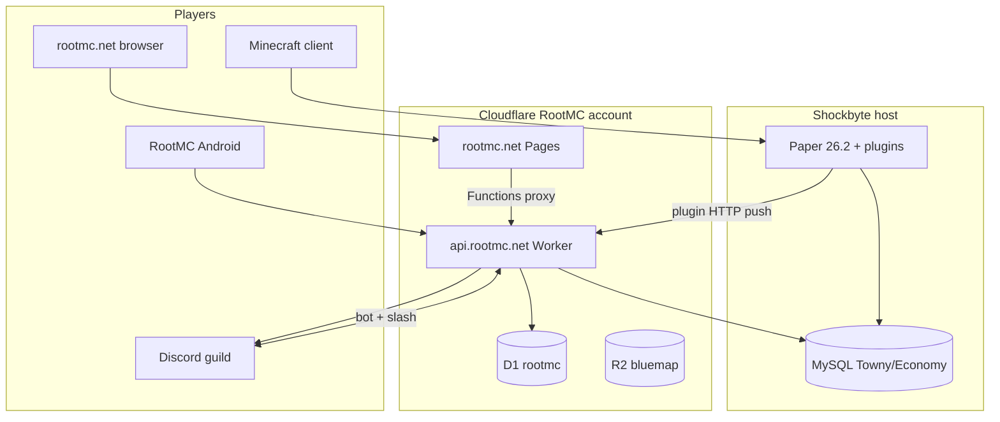

# RootMC ecosystem map

This document links every major piece so agents can reason about **cross-system** changes (game ↔ API ↔ web ↔ app ↔ Discord).

## Production topology

## Canonical URLs

| Resource | URL |
|----------|-----|
| Play server | `play.rootmc.net` |
| Website | https://rootmc.net |
| API | https://api.rootmc.net |
| Live map | https://map.rootmc.net |
| Constitution | https://rootmc.net/wiki/constitution/ |
| Player wiki | https://rootmc.net/wiki/player/ |
| Economy | https://rootmc.net/economy/ |
| Reserve / treasury charts | https://rootmc.net/reserve/ |
| Stock market | https://rootmc.net/market/ |
| Leaderboards | https://rootmc.net/leaderboard/ |
| Daily reports | https://rootmc.net/daily-report/ |
| Governance | https://rootmc.net/governance/ |
| Discord verify | https://rootmc.net/verify/ |
| Discord invite | https://discord.gg/rFFQYrNaqS |

## RootMC vs RootRecord

| | RootMC | RootRecord |
|---|--------|------------|
| API host | `api.rootmc.net` | `api.rootrecord.info` / `rootrecord-api-*` shards |
| Product | Minecraft SMP + Gold economy | Weather, Business, Account, Token apps |
| Monorepo | This repo + separate plugin workspace | https://github.com/Rootmcnet/MonoRepo |
| Cloudflare account | Dedicated RootMC account | RootRecord account |

Do **not** route new RootMC features through `rootrecord-primary` or product shards unless explicitly migrating.

## Discord (RootMC guild)

| Item | ID / value |
|------|------------|
| Guild | `1516108585740800042` |
| Bot application | `1511794429986345020` |
| #general-chat | `1516108586307158088` |
| #updates | `1520665313631408251` |
| #plugin-sales | `1529247837420912751` |
| #daily-report | `1516395175780286615` |
| MC linked role | `1516396491973984256` |
| Town / nation categories | `1516282271848726628`, `1516283613283483749` |

Interactions: `POST https://api.rootmc.net/v1/discord/rootmc/interactions`  
OAuth callback: `https://api.rootmc.net/v1/discord/rootmc/callback`

## Authentication flows

### In-game `/link` (primary for Android)

1. Player runs `/link` on `play.rootmc.net` → 6-char code (~15 min TTL).  
2. App: `POST /api/rootmc/realm/minecraft/link/app/complete` with code → JWT (~30 days).  
3. Source: `api/rootmc-realm-api/src/rootmc-minecraft-link.ts`, `rootstat-minecraft.ts`.

### Discord verify (web + optional app)

1. OAuth at `rootmc.net/verify`.  
2. Links Discord user ↔ RootRecord license account ↔ Minecraft UUID.  
3. Source: `rootmc-discord-link` routes in realm API + account shard.

## Economy & treasury (policy)

- **Currency:** Gold **G** in wallet; physical gold items redeemable at mint peg.  
- **Treasury:** `towny-server` account — all automated grants debit treasury via `RootMcTreasuryService` (plugin) or API pending transfers.  
- **Reserve:** Server reserve surplus — governing body decides use (dividends, grants, events).  
- **Stock market:** In-game listings → D1 `rootmc` tables → `/api/rootmc/stock-market` → web `market.js` + Android `StockMarketScreen`.  
- **Net worth:** wallet + inventory + chests + shop stock (plugin sync → D1).

Player-facing rules: https://rootmc.net/wiki/constitution/

## Data sync paths

| Data | Origin | API / D1 | Surfaces |
|------|--------|----------|----------|
| Wallet / net worth | Economy plugin | `economy/me`, cron MySQL→D1 | web player, Android dashboard |
| McMMO | McMMO plugin | `mcmmo/me` | web, Android |
| Playtime | Plugin / stats | `playtime/me` | web, Android |
| Treasury reserve | Treasury + crons | `treasury/rootmc` | web economy, Android |
| Daily AI report | Grok cron → Discord archive | `GET /api/rootmc/daily-report` | web + Android |
| Bluemap | Server → R2 | map URLs in server config | web embed, Android WebView |
| Shop alerts | Price watch | FCM via account shard | Android push |

## Crons (api/rootmc-api wrangler.toml)

Registered on `rootmc-api` Worker — includes `*/10`, hourly, daily, weekly jobs for economy sync, Discord digests, awards, etc. **Do not duplicate crons** on another Worker without retiring the old trigger.

## Android app surfaces

| Tab / route | Purpose |
|-------------|---------|
| RootMC | Server card, signed-in player dashboard, map, stats sections |
| Market | Item list, period charts, history |
| Economy | Reserve, flows, movers, mini leaderboards |
| Leaderboards | Net worth, playtime, mint, gold found |
| More | Auth, realms, mayor tools, settings |

Package: `com.rootrecord.rootmc`  
API client: `ServerRepository.kt`, `RootRecordAuthRepository.kt`

## Website key pages

| Path | Script |
|------|--------|
| `/` | `home.js` |
| `/economy/` | `economy/economy.js` |
| `/reserve/` | `reserve/reserve.js` |
| `/market/` | `scripts/market.js` |
| `/player/` | `player/player.js` |
| `/leaderboard/` | `leaderboard/leaderboard.js` |
| `/daily-report/` | `daily-report/daily-report.js` |
| `/governance/` | `governance/governance.js` |

Pages Functions proxy: `web/functions/api/[[path]].ts` → `api.rootmc.net`.

## Outside this repo (coordinate, don’t fork silently)

| Area | Location | Notes |
|------|----------|-------|
| Paper plugins | Canonical `Plugin Building/Minecraft/` | 17+ plugins; `publishPlugins` → handoff jars |
| Live server config | `plugins/RootRecord/rootmc.yml`, `cloud.yml` | Shockbyte via FileZilla |
| Plugin releases on web | `web/public/plugins/manifest.json` | Version heartbeat for downloads |

See [docs/PLUGINS-AND-SERVER.md](docs/PLUGINS-AND-SERVER.md).

## GitHub

See [docs/GITHUB-SETUP.md](docs/GITHUB-SETUP.md) for `git init`, remote, and Emergent connection steps.

## Secrets (never in git)

Copy [.env.example](.env.example) → `.env` at repo root:

- `CLOUDFLARE_API_TOKEN`, `CLOUDFLARE_ACCOUNT_ID`  
- `JWT_SECRET`  
- `DISCORD_ROOTMC_BOT_TOKEN`, `DISCORD_ROOTMC_CLIENT_SECRET`  
- `GROK_API_BEARER_TOKEN`, `GROK_ROOT_ASK_BEARER_TOKEN`  
- Optional: FCM JSON path for shop alerts  

Android: `google-services.json`, signing keystore — local only.
